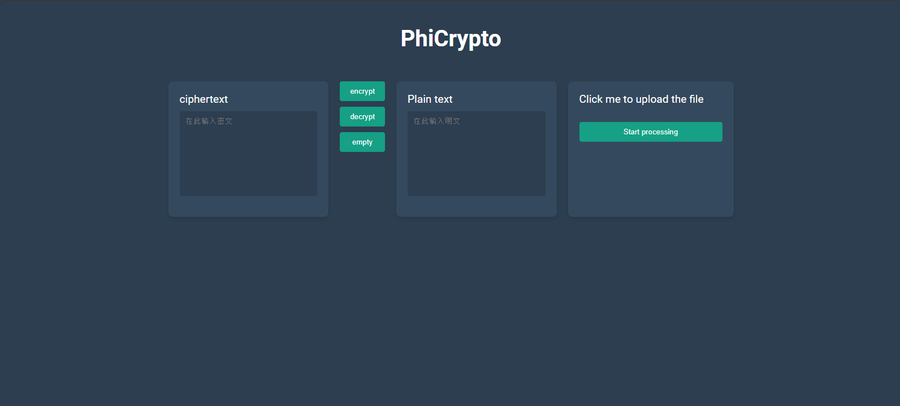

# PhiCrypto

PhiCrypto is a web application designed to decode and encode save files for the game Phigros, developed using JavaScript. To avoid abuse, the key and IV have been removed.

## How to Use

1. **Fill the Key and IV**
2. **Install Node.js**
3. **Install Dependencies**
    ```bash
    npm install express body-parser cookie-parser
    ```
4. **Run the Application**
    ```bash
    node .
    ```
5. **Open the web**
   ```
   http://<ip>:8080/
   ```
   The default password is `luobo233`,you can change it on index.js
## Contact

- **QQ Group**: 736770364
- **Discord Channel**: [Join Here](https://discord.gg/phigros-and-rhythm-gaming-1039084623260569631)

## Thanks
[PhigrosLibrary](https://github.com/7aGiven/PhigrosLibrary) by [@7aGiven](https://github.com/7aGiven)
